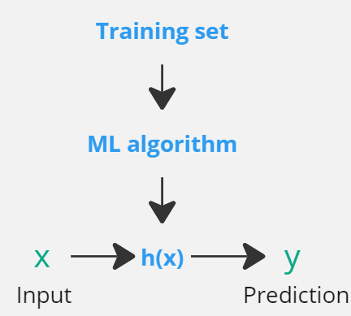
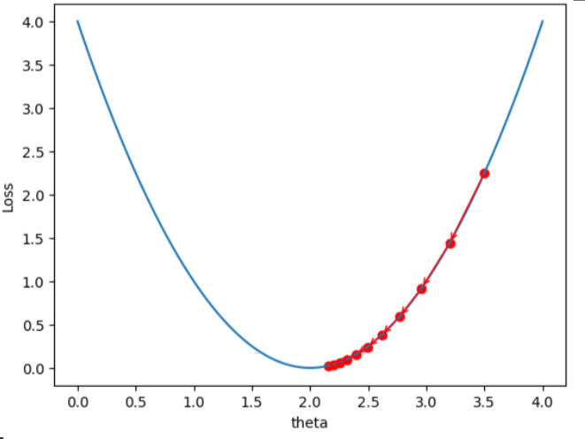

# Part 1: Supervised Learning

In supervised learning, the goal is to train a  hypothesis function h(x) to map the input x to the output y (h:X→Y).

  

---

## Chapter 1: Linear Regression: 
The hypothesis function in linear regression for a two dimensional input (a regression problem with two features: x1 and x2 ) could be represented as below:

$h_{\theta}(x)/h(x) = \theta_{0} + \theta_{1}x_{1} + \theta_{2}x_{2} = \theta^{T}x$, where:

- $\theta_{0}$ is the y-intercept or bias term.
- $\theta_{1}$ and $\theta_{2}$ are the weights for features $x_{1}$ and $x_{2}$, respectively.
- $\theta^{T}$ is the transpose of the weight vector, represented as a row vector.
- $x$ is the input feature vector, represented as a column vector.

The next step is to formulate a loss function to represent the discrepancy or error of $h(x)$. The most common loss function for a linear regression algorithm is the sum of mean squared error (or Least squares cost function):

$J(\theta) = \frac{1}{2m} \sum_{i=1}^{m} (h_{\theta}(x^{(i)}) - y^{(i)})^2$

`Note` that the mean squared error loss function is a convex function since it has a unique global minimum.

### Least Mean Square (LMS)
Having the loss function, the next step is to minimize the loss function through an iterative process (e.g., using gradient descent algorithm):

$\theta_{j} := \theta_{j} - \alpha \frac{\partial}{\partial \theta_{j}} J(\theta)$

where:
- $\theta_{j}$ is the j-th weight parameter.
- $\alpha$ is the learning rate that controls the step size in gradient descent.
- $\frac{\partial}{\partial \theta_{j}} J(\theta)$ is the partial derivative of cost function with respect to $\theta_{j}$ used to update the parameter.

The figure below illustrates the iterations to obtain the global min of a loss function:

  

`Note` that each iteration in Gradient Descent can incorporate either one random training sample or the entire samples. When using the entire samples in each step, it's called Batch Gradient Descent (BGD) which is typically just referred to as Gradient Descent. In the former case, where only one random training sample is used, it's called Stochastic Gradient Descent (SGD).

`Note` that the weights of the hypothesis function could be determined directly using the below close form analytical equation (termed normal equation) which is more suitable for small to medium sized dataset compared to the numerical optimization approaches (e.g., gradient descent):  

$θ = (X^T X)^{-1} X^T y~$  
where:
- $\theta$ = vector of the optimal parameter values
- $X$ = matrix of the training examples
- $\tilde{y}$ = vector of target values

---
## Chapter 2: Classification and logistic regression
Classification is quite similar to the regression except here the output only includes a limited number of discrete values, for instance if it is a binary classification, then the output is either 0 or 1 where 1 is considered the positive class and 0 the negative class.
 
 ### Logistic regression
In a classification problem (e.g., a binary classification), the hypothesis function should output limited discrete values. Therefore, using a linear regression hypothesis function may not work effectively, and instead, a logistic or sigmoid function is used:

$g(z) = 1 / (1 + e^{(-z)})$

$g(θᵀx) = hθ(x) = 1 / (1 + e^{(-θᵀx)})$ 

where $hθ(x)$ is bounded between 0 and 1. 

Similar to linear regression, in order to find the weights for the hypothesis function we should find the corresponding loss function and then minimize it using gradient descent.

$J(θ) = (-1/m) * ∑(i=1 to m) [y^{(i)}*log(hθ(x^{(i)})) + (1-y^{(i)})*log(1-hθ(x^{(i)}))]$

Using loss function, the gradient descent is:  

$θj := θj - α * ∂J(θ) / ∂θj$

Alternatively, weight parameters could be obtained by maximizing the likelihood function which is -log of loss function. The likelihood function which gives the probability of observing 1 as output label given x as training data and θ as the parameter is as below.

$L(θ) = ∏ᵢ p(yᵢ|Xᵢ, θ) = ∏[hθ(x^{(i)})]^{y^{(i)}} * [1 - hθ(x^{(i)})]^{(1-y^{(i)})}$  
where:
- `∏ᵢ` is the product operator that multiplies the probabilities
- `p(yᵢ|Xᵢ, θ)` is the probability of having `yᵢ` given `xᵢ` and `θ`. 

The weight parameters could be obtained by maximizing the likelihood function above, using gradient ascent:

$θj := θj + α∂/∂θj(log L(θ))$ 

`Note` that the weight parameters could also be derived using Newton's method by maximizing the log likelihood function iteratively. In each iteration the Newton's method finds the root of the first derivative of the function (known as `score function`) to get the direction and the second derivative (`Hessian matrix`) to get step size for updating the weight parameter of the hypothesis function and repeats the process until converging to the max of log likelihood function. The Newton's optimization method is used sometimes over gradient ascent as it can improve convergence speed in certain cases.

`Note` that if instead of the sigmoid function, a simple threshold function is utilized as the hypothesis function (i.e., g(z) = 1 if z>=0 and g(z)=0 if z<0>), then it is called the `Perceptron learning algorithm`.

### Multi-class classification

Although the idea of binary classification could be expanded to be used in multi class problems, there are direct methods to train a model and extract the weight parameters. The `multinomial` model is a suitable model which aims at assigning a probability to each possible outcome by meeting the condition that the sum of the probabilities should be 1. It uses a `softmax` function which takes the vector of inputs (`logits`) and transform them into probability vectors. The `softmax` function is then used to compute the probability for every possible outcome. Then the `cross entropy loss` which is a modularized form of `negative log likelihood` is used to compute the discrepancy of the model predictions. The `gradient descent` algorithm is then used to derive the weight parameters.  

---
## Chapter 3: Generalized linear model
Generalized linear models (GLMs) utilize the framework of exponential family distributions to analyze the relationship between independent and dependent variables. In GLMs, the choice of distribution depends on the nature of the problem, with the Bernoulli distribution commonly used for classification tasks and the Gaussian (or normal) distribution for regression.

`Note` that the Gaussian (normal) distribution, synonymous in this context, is a continuous probability distribution characterized by a symmetrical bell-shaped curve. It is typically employed in regression settings to model continuous variables. Whereas, the Bernoulli distribution is a discrete probability distribution designed for binary outcomes. It assigns probabilities to two possible outcomes, typically labeled as 0 and 1, making it suitable for classification problems.

`Note` that the exponential family distribution is a mathematical form of probability distribution. It is termed as such as the exponential term within it's probability density function has the key role. So the exponential distribution which is a specific distribution within the exponential family should not be mistaken with the family distribution itself. 

Training a machine learning model involves a series of steps. Initially, we assume that our data follows a certain distribution, often from the exponential family like Gaussian, Bernoulli, or Poisson. We then specify a hypothesis function that represents the relationship between our input features and the target variable, with parameters or "coefficients". Based on this distribution and model, we derive the `likelihood function`, which *`quantifies the probability of observing our data given the model parameters`*. The final step involves an optimization process, commonly known as `maximum likelihood estimation (MLE)`, where we use an algorithm (such as gradient descent) to find the parameters that maximize this likelihood function. This way, we adjust the model's parameters so that it closely fits our observed data.

Let's say you have a simple linear model, y = β0 + β1*x + ε, where β0 and β1 are the parameters you want to estimate, x is your independent variable, y is the dependent variable, and ε is an error term. The likelihood function in this case is based on the assumption that the error term (ε) follows a normal distribution. This function, when maximized, gives the values of β0 and β1 that make the observed data most probable.

---
## Chapter 4: Generative learning algorithm
There are two main types of learning algorithms when it comes to classification problems. The generative learning algorithm such as Gaussian Naive Bays, which attempts to model the underlying probability distribution of the input variable for each class separately; and the discriminative learning algorithm such as logistic regression which aims at finding the best decision boundary to separate different classes and directly mapping the input variables to the output class labels.

`Note` that the discriminative learning algorithm uses conditional probability distribution (p(y|x)) which is the probability distribution of y given input features x. On the other hand, the generative learning algorithm uses joint distribution (p(x, y)) which is the probability distribution of both input feature x and output label y. This enables generative learning algorithms to be able to generate synthetic data which replicates the same probability distribution of training data.

`Note` that the joint probability distribution represents the probability of the simultaneous occurrence of all possible combinations of target variables and features. It is denoted as P(X1, X2, ..., Xn), where xi is a random variable. On the other hand, the conditional probability distribution focuses on finding the probability of the target variable given the features. It is represented as P(Y|X) = P(X, Y) / P(X), where P(X, Y) is the joint probability distribution and P(X) is the marginal probability distribution of variable X.   

---
## Chapter 5: Kernels
### Feature maps
The features maps the attribute variable to the feature variable where the attribute variable is the physical and original input variable whereas the feature variable is some variation of the attribute variable. For instance $\theta_{0} + \theta_{1}x_{1}$ which represents a hypothesis function for a linear regression algorithm could be mapped to higher order terms to also represent more sophisticated patterns (nonlinear relationship between data) as below:
$\theta_{0} + \theta_{1}x+ \theta_{2}x^2+ \theta_{3}x^3$. 
### Least mean squares (LMS) with features
The feature map φ(x) is used to transform the input data into a higher-dimensional space, allowing for a more expressive representation of the relationship between the independent variables and the target variable. By incorporating the feature vector φ(x) into the hypothesis function, represented by θ^T φ(x), the model can capture complex patterns and nonlinear relationships in the data. However, working directly with the high-dimensional feature vectors can be computationally expensive, especially when the dimensionality is large. To address this issue, the kernel function is employed. The kernel function allows us to estimate the dot product between θ^T and φ(x) without explicitly computing the high-dimensional feature vectors. Therefore, the iterative update of theta in the lms algorithm is done using the kernel function.

`Note` that the lsm algorithm represents a combination of mean square error loss function and an optimization algorithm such as gradient descent to find the optimal values for model weight parameters.
### Properties of kernel function
Kernel function quantifies the similarity or dissimilarity between pairs of data points in high dimensional space which allows to capture complex underlying patterns within the data without explicitly calculating a high dimensional feature vector (i.e., transforming inputs into higher dimension).

So effectively the feature mapping is required to transform the data to higher dimensions when underlying structure of data could not directly be captured in the original feature space. If this is the case, kernel function could be used to do the same without needing this transformation. Therefore, for each iteration in the gradient descent, the θ value could be computed using kernel function instead of directly computing θ^Tφ(x) which is also called kernel trick.. 

One important step when using kernel function is to find out if there is a mapping function φ such that the kernel function is equal to φ(x)Tφ(z). If this is the case then we can directly work with the kernel function K(x, z) instead of computing high feature vectors. Therefore, the typical approach would be to first choose a kernel function and then determine a feature mapping that corresponds to that.

---
## Chapter 6: Support vector machines (SVM)
SVM is a discriminative learning algorithm which focuses on the confidence of prediction based on the distance between a given data point against the `decision boundary` obtained using training data. The larger the margin between the boundary and data point the higher confidence in prediction. Hence, the goal in SVM algorithm is to determine the decision boundary which can maximize the margin, resulting in better separation and classification of data points, where margin refers to the distance between the decision boundary and the closest training points from each class (also called `support vectors`).

`Note` that while in SVM the focus is to maximize the margin between decision boundary and data points other classification algorithm such as logistic regression the same goal is presumed indirectly by maximizing the log likelihood function and hence maximizing the probability of the observed data. 

In SVM the linear classifier is parametrized by b and w with the hypothesis function being g(w^T x + b), where g outputs 1 if the argument is greater or equal to 0 and -1 otherwise. Also, the confidence in prediction could be represented by  the `functional margin` as y(w^T x + b) where x and y are training input data and associated labels, respectively. Besides, the measure of confidence could be more meaningfully captured using `geometric margin` which is the distance between the data point closest to the decision boundary and the boundary itself. The functional margin is then used in the hinge loss function to formulate the optimization framework to maximize the margin and also correctly classify training data into different classes. 

Since th hinge loss function is not always differentiable the gradient descent is not directly applicable in SVM and instead the `sequential minimal optimization (SMO)` is employed to find the optimal values for w and b. The SMO algorithm breaks down the optimization problem into smaller sub-problems by iteratively updating the `lagrange multipliers` (also known as `dual variables`) which is a constrained optimization technique that maximizes the margin by meeting certain constraints. In short, it is a scaler value assigned to a training sample to enforce correct classification of training samples.

`Note` that in order to make the optimization framework to obtain optimal parameters which are generalizable for unseen data, the regularization parameters C is incorporated in the SMO algorithm with the goal to balance the trade off between maximizing the margin and minimizing the classification error. The choice of C is important for achieving a good balance between model complexity (margin size) and generalization performance.

To recap, the goal in SVM is to find a decision boundary (hyperplane) that can accurately separate the different classes in the training data. This decision boundary should not only classify the training data correctly but also maximize the margin between the decision boundary and the closest training points from each class. 