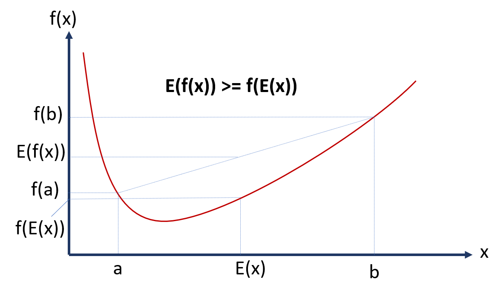

# Part 4: Unsupervised Learning
Unsupervised learning is employed to manipulate and derive insight from unlabelled data.
### K-means
The K-means algorithm is a widely used clustering method for grouping unlabeled data into a specified number of clusters. It operates through iterative steps until convergence is reached. These steps involve:

- Assuming the value of k, representing the desired number of clusters.
- Randomly initializing centroid positions for each cluster.
- Assigning each data point to the nearest cluster centroid.
- Updating the centroid positions and assignments.  

Convergence is determined by achieving a distortion threshold, which measures the sum of squared distances between data points and their assigned cluster centroids. To optimize the assignments and centroid positions, the algorithm employs coordinate descent. In each iteration, it minimizes the distortion function with respect to one constraint (either centroid coordinates or point assignments) while treating the other as constant. Since the distortion function is not a convex function (i.e., there are multiple local minima), once the optimization is converged, it will be repeated by new initialization of centroids and the iteration which leads to lowest distortion value is selected for grouping the data points.
### Mixture of Gaussian
"The mixture of Gaussian model is an unsupervised algorithm used for clustering data into a certain number of groups, where each group is represented by a Gaussian distribution. The goal is to estimate the optimal means and covariances of the Gaussian distributions for each group and uncover the assignment of each data point to the correct group, which is encoded in a hidden variable called the `latent variable`. 

To train the model and find the optimal parameters and assignments, the `EM algorithm` is employed. The algorithm iteratively improves the estimation by performing the E-step and M-step. In the E-step, the latent variable is approximated to determine the probabilities of data points belonging to each group. In the M-step, the distribution parameters are updated based on the  assignments obtained in the E-step. The refinement of assignments and parameter estimates continues until convergence.

In simpler terms, in the E-step (Expectation), we assign each data point a "weight" for each Gaussian distribution in the mixture, reflecting the probability of that data point being generated from that Gaussian. These weights indicate how similar a data point is to each Gaussian's current parameter values. Then, in the M-step (Maximization), we adjust the parameters of each Gaussian distribution (the mean and variance), as well as their proportions in the mixture, to maximize the likelihood of the observed data given these parameters. This is effectively using our weights from the E-step to update our guesses for the parameters in a way that better matches the data. These two steps are iteratively repeated until the parameters and weights stop changing significantly, indicating that the best fit for the data has been found.

Two obvious advantages of using the mixture of Gaussian over the K-means method are: 
- the number of clusters in the mixture of Gaussian is automatically calculated as opposed to the K-means method which requires specifying the K value in advance.
- despite K-means method, in the mixture of Gaussian the cluster could have a non-spherical shape.

### Jensen's inequality
Jensen's inequality is a mathematical concept that enables us to monitor the behavior of a function which in the context of EM algorithm helps us to ensure the likelihood of the observed data is consistently increasing. The application of Jensen's inequality on convex curve states that for any two variable values a and b, the the mid point of of the application of function f to points a and b separately ($E(fx)$) is greater or equal to the application of function f to the midpoint between a and b ($f(E(x))$). This is also visualized in the figure below:

  

### Principal Component Analysis (PCA)

PCA is an efficient method to reduce data dimensionality by maintaining the majority of variance within the data. It is done by normalizing the data and then identifying the diction in the data space that has the highest variation of data, which is called `major axis of variation` or the first principal component. Other components are derived the same way by with a new constraint that each subsequent component should be orthogonal to the previous component to avoid correlation between components. Hence the data with original n features could now be represented by fewer number of components, which is called dimensionality reduction. This technique has multiple use cases in data compression (e.g., representing images with a small number of components), data visualization (e.g., visualizing high dimensional data in a 2d space), data pre-processing (e.g., to reduce computation and overcome overfitting), and noise reduction.  

`Note` that each component in PCA is a combination of original data features and if the direction of a component is closer to a feature it does not necessarily signify the feature's importance, but rather it simply indicates that the feature exhibits more variability.

### Independent Component Analysis (ICA)

ICA is a technique to separate source data from mixed data (e.g., overlapped images). A typical use case of ICA is to separate the voice of each speaker in a cocktail party from the recordings taken at random locations within the party venue. The ICA could be mathematically represented by x = As where x is the observation (mixed data), s is the source data, and A is the unknown mixing matrix. The goal is to find the unmixing matrix $A^{-1}$ (denoted as W), which, when applied to the mixed data x, allows us to recover the original source data: $s = Wx$.

Here is the process to recover the source data: 
- The Cumulative Distribution Function (CDF) of each source is assumed to be a sigmoid function.
- The Probability Density Function (PDF) of each source is then obtained as the derivative of the CDF.
- Assuming the sources are independent, the joint PDF of all sources is expressed as a product of the individual source PDFs.
- The PDF of the mixed data is then calculated as a transformed version of the joint PDF, where the transformation is dictated by the mixing matrix.
- The likelihood function is then formed as the product of the values of this PDF evaluated at the observed data points.
- This likelihood function is maximized to estimate the unmixing matrix, W.
- Finally, the estimated W is used to recover the original sources from the mixed data.