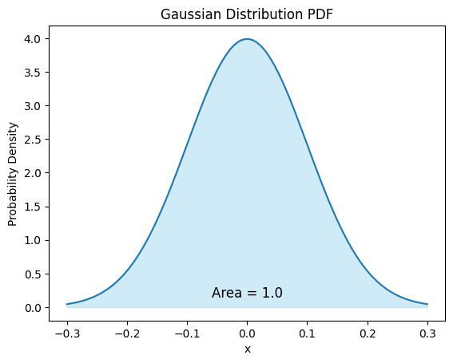

# Probability and Statistics
This is a side note providing background on some of fundamental concepts on probability and statistics that are discussed in the main notes. 
## Joint probability distribution
Joint probability distribution is the probability distribution of multiple random variables occurring at the same time. If there are two variables x and y, the join probability distribution is represented by $P(X,Y)$ which provides the probability of different combination of values that x and y could take on.  

**Example**

Let's consider two variables, x and y. Assume x can take values {1, 2} and y can take values {a, b}. The joint probability distribution, P(X, Y), represents the probabilities of different combinations of x and y occurring simultaneously. Let's assume the following probabilities:

P(x=1, y=a) = 0.3  
P(x=1, y=b) = 0.2  
P(x=2, y=a) = 0.4  
P(x=2, y=b) = 0.1  

These probabilities represent the likelihood of observing specific combinations of x and y. For example, P(x=1, y=a) indicates the probability of x being 1 and y being a occurring simultaneously. A simple physical example in a deck of playing card would be the probability of drawing a card that is both a king and a heart which is 1 out of 52.

## Conditional probability distribution

The conditional probability distribution (CPD) refers to the likelihood of observing certain sets of data given other sets of data.

**Example**

Consider two variables, x and y. Assume x can take values {0, 1} and y can take values {a, b}. The conditional probability distribution, P(Y | X), represents the likelihood of observing different values of y given specific values of x. Let's assume the following conditional probabilities:

P(y=a | x=0) = 0.8
P(y=b | x=0) = 0.2
P(y=a | x=1) = 0.3
P(y=b | x=1) = 0.7

These conditional probabilities indicate the likelihood of observing the values of y (a or b) given specific values of x (0 or 1). For example, P(y=a | x=0) indicates the probability of y being a when x is 0. A simple physical example in the game of playing card is if we already know we have drawn a king but we want to know the likelihood of king heart which in this case is 1 our of 4.

## Probability Density Function (PDF)
The probability density function (PDF) represents the relative likelihood of different values that a continuous random variable could take on. The PDF provides the probability density, which could be used to compute the probability of the variable falling within a particular range. However, it doesn't give the probability of a specific outcome, but rather the probabilities for ranges of outcomes. One important property of a PDF is that the integral over its entire range (the area under the curve) is equal to 1. In other words, the total probability of the variable falling within any possible range is 100%.

**Example**  

for a random variable with Gaussian distribution the pdf (with the following plot) could be represented by $f(x) = (1/(σ*√(2π)))*exp(-(x-μ)²/(2σ²))$ where `μ` is the mean and `σ` is the standard deviation.  

  

## Likelihood function
The likelihood function represents the conditional probability of observing a specific set of data given a certain set of parameters within a statistical model. In the context of a linear regression model, the likelihood function specifically measures the conditional probability of observing the dependent variable data points (y) given the independent variable data point (x) and the weight parameters (θ) in the hypothesis function.

According to Bayes' theorem, the likelihood function is represented as `P(Y|X,parameters) = P(X,Y|parameters)/P(X|parameters)`. The joint probability distribution, `P(X,Y|parameters)`, accounts for the assumptions made by linear regression, such as linearity, independence, and the Gaussian distribution of errors. It captures the probability of simultaneous occurrence of different combinations of x and y based on these assumptions. On the other hand, the conditional probability distribution, `P(X|parameters)`, represents the probability of x given the linear regression parameters. In linear regression, x is assumed to be deterministic, meaning it does not have a distribution itself.

To find the optimal values for the parameters in linear regression, we aim to maximize the likelihood function. This involves utilizing optimization algorithms like gradient ascent to identify the parameter values that maximize the probability of observing y given x and the regression model. In practice, it is often more convenient to work with the log likelihood function due to its numerical stability and computational efficiency.

**Example**

Let's go through the above steps with a simple example with linear regression model to further clarify the principles:

independent variable, x: [2, 3, 4]
dependent variable, y: [100, 120, 130]

- Joint Probability Distribution:  
The joint probability distribution represents the assumptions made by linear regression. In this case, we assume a linear relationship between x and y with Gaussian errors (ε=yi - (β0 + β1*xi)) with 0 mean (μ) and unknown variance (σ2).
- Hypothesis function:   
y = β0 + β1*x
- Joint probability for one data point which is obtained from Gaussian PDF:  
P(yi | xi, β0, β1, σ²) = (1/√(2πσ²)) * exp(-εi² / (2σ²))  
P(yi | xi, β0, β1, σ²) = (1/√(2πσ²)) * exp(-(yi - (β0 + β1*xi))² / (2σ²))
- Likelihood function which simply is the Joint probability for the entire dataset assuming that the data points are independently and identically distributed (i.i.d):  
L(β0, β1, σ | X, Y) = Π [1 / √(2πσ^2)] * exp[-(Y - (β0 + β1*X))^2 / (2σ^2)]

- let's assume initial parameter values for bias, weight coefficient, and variance of error as β0 = 0, β1 = 0, σ = 1. The likelihood value is:   
L(0, 1, 1 | [2, 3, 4], [100, 120, 130]) = [1 / √(2π)] * exp[-(100 - (0 + 2))^2 / (2^2)] * [1 / √(2π)] * exp[-(120 - (0 + 3))^2 / (2^2)] * [1 / √(2π)] * exp[-(130 - (0 + 4))^2 / (2^2)]

The next step is to iteratively compute the likelihood values for other parameters and find those that yield to highest likelihood value (`Maximum Likelihood Estimation (MLE)`).