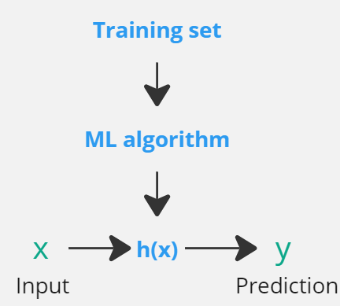

# Part 1: Supervised Learning

In supervised learning, the goal is to train a  hypothesis function h(x) to map the input x to the output y (h:X→Y).

  

## Linear Regression: 
The hypothesis function in linear regression for a two dimentional input (a regression problem with two features: x1 and x2 ) could be represented as below:

$h_{\theta}(x)/h(x) = \theta_{0} + \theta_{1}x_{1} + \theta_{2}x_{2} = \theta^{T}x$, where:

- $\theta_{0}$ is the y-intercept or bias term.
- $\theta_{1}$ and $\theta_{2}$ are the weights for features $x_{1}$ and $x_{2}$, respectively.
- $\theta^{T}$ is the transpose of the weight vector, represented as a row vector.
- $x$ is the input feature vector, represented as a column vector.

The next step is to forulate a loss function to represent the discreapancy or error of $h(x)$. The most common closs function for a linear regression algorithm is the sum of mean squared erro (or Least squares cost function):

$J(\theta) = \frac{1}{2m} \sum_{i=1}^{m} (h_{\theta}(x^{(i)}) - y^{(i)})^2$

`Note` that the mean squread erorr loss function is a convex function since it has a unique global minimum.

### Least Mean Square (LMS)
Having the loss function, the next step is to minimize the loss function through an iterative process (e.g., using gradient decsent algorithm):

$\theta_{j} := \theta_{j} - \alpha \frac{\partial}{\partial \theta_{j}} J(\theta)$

where:
- $\theta_{j}$ is the j-th weight parameter.
- $\alpha$ is the learning rate that controls the step size in gradient descent.
- $\frac{\partial}{\partial \theta_{j}} J(\theta)$ is the partial derivative of cost function with respect to $\theta_{j}$ used to update the parameter.

`Note` that each iteration in Gradient Descent can incorporate either one random training sample or a batch of samples. When using a batch of samples, it's called Batch Gradient Descent (BGD).

